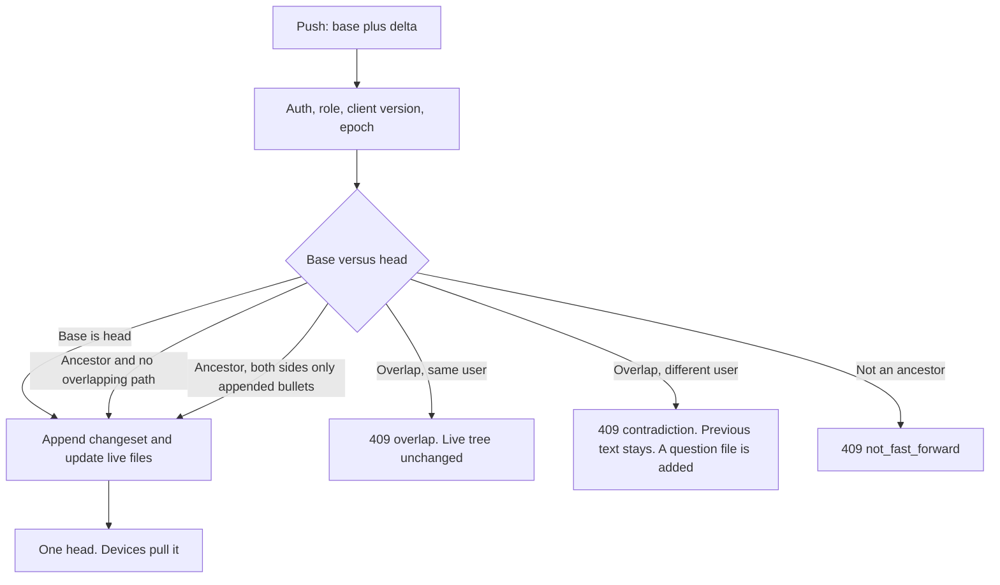

# History and shared memory

Status: **design**. Not ABI. Shipping this text does not change the protocol, the on-disk vault, or the version.

`abi/` stays the contract until a milestone below actually ships. This document is the plan for the remote mirror after 1.2.0 (PR #14, on `dev`): how a write becomes history, how a person and a device are named, how more than one person shares a scope, and how a disagreement becomes a question instead of a silent overwrite.

Read time: the body is the decision. Schemas, routes, and worked flows are in the appendices.

## 1. The failure this has to make recoverable

Example incident: a machine that has not synced for a while pushes its whole vault. The server union-merges it. Deleted projects come back, and paragraphs in `USER.md` are replaced by older text. Recovery means hand-written `DELETE` / `PUT` against the live files. Nothing on the server can answer "what did this path look like at 18:00?" or "undo that push."

1.2.0 stops the same *class* of accident when the operator bumps the vault epoch, and tombstones stop a missing path from being treated as "still there." It does not record the accepted bytes, does not name who sent them, and still treats a whole-file push of `USER.md` as last push wins. Two machines on the same epoch can still clobber each other. Agents will not sit in a merge UI and repair that.

The next step has to be built properly: lightweight enough for a single-container self-host, reliable enough that a bad push is one command to undo, and shaped so a team and later an enterprise can use the same protocol. Git's useful ideas are in scope: an append-only history, revert as a new record, fast-forward checks, and a merge that looks at the base both sides started from. Branches, in-file conflict markers, and "hand this to an agent to merge" are out of scope. Memory has one shared head per scope.

## 2. Invariants

These stay true across every milestone. A milestone that breaks one of them is the wrong milestone.

1. **The live markdown is the current truth.** Readers, MCP, and `grep` on the server read files. History is the log of how those files came to be. A human can still open `USER.md` on the server.
2. **Markdown wins over indexes.** The FTS index stays a disposable cache. History is not a cache: deleting it loses the past and keeps the present. You cannot rebuild yesterday from the live tree except as a new genesis with an empty past.
3. **One head per scope.** Every device materializes that head. A dirty working copy (edits since the last accepted base) is private until the server accepts it.
4. **The server accepts or rejects.** It does not ask an agent to resolve a merge, and it does not write `<<<<<<<` into a file.
5. **The solo install stays one process and a directory.** Postgres, object storage, SSO, and any LLM job are optional backends behind the same objects. They are not required to boot `remote serve`.
6. **No LLM on the accept path.** A push is deterministic. An optional consolidation job, if it ever exists, writes staging proposals and is off unless the operator turns it on.
7. **Stdlib-shaped Python.** JSON, files, hashes, the HTTP stack that already exists. New dependencies are extras, imported only when that tier is configured.
8. **Deletes stay explicit.** Tombstones remain the delete signal. A file that is merely absent from a push is not a delete, except where 1.2.0 already infers absence from the sync baseline.

Out of scope for the whole line of work, not only for 1.3:

- Branches, refs, and a second checkout of the same scope.
- Multi-master writes to one scope. High availability is failover onto one writer.
- CRDTs and semantic merge of prose.
- Embeddings or a vector database as the store.
- Syncing chat graves, `.index/`, or `remote_config.json` (already excluded).
- Rewriting an accepted changeset in place. Undo appends a new one.
- Folding the board-attach DID flow (`remote attach`, `agents-keys`) into `connect`. That door stays until a project scope replaces it for a given repo.

## 3. What 1.2.0 actually does

Local files are the working copy. `sync_mcp` pulls on startup, pushes after a write, and pulls about every 60 seconds. The server stores a mirror of the bundle under its own `~/.agents/memory`.

| Piece | Where | Role |
| --- | --- | --- |
| Live bundle | server store | `USER.md`, notes, `rules/*.mdc`, `mirror/projects/<slug>/…` |
| Auth | `Authorization: Bearer` | One shared token (`AGENTS_MEMORY_TOKEN`). No user, no device. |
| Epoch | `.epoch`, client copy in `remote_config.json` | Writer behind the server epoch gets **409** `epoch_mismatch`. Epoch 0 accepts everyone. |
| Min client | `AGENTS_MEMORY_MIN_CLIENT_VERSION` | Writer older than the floor, or with no `X-Agents-Memory-Version`, gets **426**. Reads stay open. |
| Tombstones | `.tombstones.json` | Files, prefixes, `PROJECTS.md` rows, bullets. Newer explicit re-add wins. Entries older than 90 days drop. Not part of the file bundle. |
| Explicit writes | `.sync-writes.json` | Re-adds that must beat a prefix tombstone. |
| Baseline | `.sync-baseline.json` on the client only | Paths, `PROJECTS.md` slugs, sha256 per file at last sync. Missing baseline means "replay nothing" after a 409 replace-pull. |
| Replace | `remote pull --replace`, `remote push --replace` | Exact tree, backup under `*.bak-<UTC>`, then epoch bump on the push form. |

Merge, in `merge_markdown_files`:

- `USER.md`, `CLAUDE.md`, `AGENTS.md`, `*.mdc`, and `staging/` are **incoming wins** for the whole file. The push that arrives last replaces the server bytes. There is no check that the client based that edit on the current server bytes.
- Other markdown is a **union** of bullets. `PROJECTS.md` is a union of rows; on a row both sides edited, incoming wins, and a line is appended to `staging/sync-conflicts.md` whose header says the conflict was resolved that way.
- A path missing from the push is not deleted. Deletion is a tombstone, a baseline absence, or `DELETE /api/v1/file`.

Two holes remain, and they are different.

The example incident is a normal push, not a 409. The stale machine sends its tree. The server union-merges bullets and rows, so deleted projects return unless a live tombstone blocks them, and incoming-wins replaces `USER.md` with whatever that push contains. Tombstones expire after 90 days. Nothing checked that the sender had based the edit on the current server bytes.

The 409 path has a second hole, for after an epoch bump. `remote_push_merge` catches `EpochMismatch`, `pull --replace`s, then `reapply_pending` writes back every local file whose sha256 differs from `.sync-baseline.json` (and any path the baseline does not list). `remote_pull` does the same when the snapshot epoch is ahead. If this machine edited `USER.md` since its baseline, those paragraphs are put back on top of the server copy and pushed again. Two machines that are still on the same epoch never enter this path: the later push wins outright.

`remote attach` is a separate, read-shaped door for one project tree. It does not carry `USER.md` and does not switch MCP to `sync_mcp`. Shared memory should grow from scopes, not by overloading `connect` with a second vault.

## 4. The model, on one page

Borrow the git objects that match this product. Leave the rest.

| Object | Meaning |
| --- | --- |
| Blob | Exact file bytes, named by `sha256`. Immutable. Shared by every changeset that had those bytes. |
| Changeset | One accepted write. Single parent: the head it was applied onto. Records actor, device, client version, epoch, scope, server timestamp, and per-path before/after blob hashes. |
| Head | The current changeset id of one scope. This is the shared truth. |
| Checkpoint | A full path-to-blob listing, stored as a blob, every N changesets. `restore` replays from here instead of from genesis. |
| Attempt | A rejected push, appended to a side log. It has no parent link into the head chain and cannot be checked out. |
| Epoch | The coarse fence 1.2 clients already understand. Kept. Bumped when a history operation must force every old writer to replace-pull. |
| Question | A normal markdown file in the scope, opened when two authors disagree. The previous accepted text stays live. |

A push carries the **base** changeset the client last materialized, plus the paths that differ from that base, plus blobs the server does not already have. The server applies the push only when it is a fast-forward or a trivial merge (section 5). Otherwise the live tree does not change.

Undo is a new changeset: `revert` inverts one changeset when the touched paths are still at that changeset's after-hash; `restore --at` materializes an older tree forward onto the head and bumps the epoch. Neither edits the old record.

Identity, when it arrives, is a user, a device, and a revocable credential. The changeset stores those ids. Scopes split today's one vault into a private personal tree and a shared project tree, each with its own head. The client composes them into the folders the ABI already uses (`~/.agents/memory` and `<repo>/.agents/memory`).



## 5. Server-side history and undo

### 5.1 What a changeset is

Every accepted mutation becomes one changeset: `POST /api/v1/merge` (while legacy is still allowed), `PUT`/`DELETE /api/v1/file`, `POST /api/v1/tool` when it writes, `push --replace`, epoch bump, revert, and restore. A rejected push does not.

The server stamps `at` when it accepts the write. Client clocks are not the order. A client may send `authored_at` for display; `restore --at` uses the server stamp.

The changeset id is the sha256 of its canonical body (appendix A). A chain hash covers `previous chain hash || id`. `remote history fsck` recomputes both. The id is the integrity value; the CLI accepts a unique prefix.

Parent is always the head the write landed on, including a trivial merge. The client's older base is recorded in `base`. There is no two-parent merge node, because there is nothing to branch from.

`files[]` lists only paths that changed. `before` is null on add. `after` is null on delete. Tombstones are included as the before/after hash of the tombstone document, so a revert can restore a delete with the same rules as an explicit re-add (a strictly newer write beats the tombstone).

Diffs are not stored. `show` runs a unified diff over the two blobs. The bytes in the blob are the bytes that were accepted, which keeps the hash honest and matches "file as given."

### 5.2 Accept rules

Lock: one exclusive lock per scope (the solo store is one scope). Readers of existing blobs and of the log up to the last complete line do not take it. `GET` of head is the cheap poll `sync_mcp` should do before downloading a snapshot.

1. Credential can write this scope. Client version passes `min_client_version`. Epoch is current. `push --replace` and `restore` remain allowed to move the epoch, as today.
2. Every `before` hash equals the blob at `base` for that path. A client cannot claim a base it does not have.
3. **Fast-forward.** `base == head`. Apply the delta. New parent is head.
4. **Trivial merge.** `base` is an ancestor of head, and no path in the delta changed between base and head. Apply the delta onto head. New parent is head, not base.
5. **Append-only trivial merge.** The path is in the append set (`concepts/`, `entities/`, `workflows/`, `notes/` except revise-in-place files, and `staging/`). Both sides, relative to base, only added lines. The accepted result is base plus both sets of added lines. A line either side deleted or edited is an overlap. Today's bullet union is what this replaces for that set. `staging/` is in the set on purpose: 1.2.0 treats a staging file as whole-file incoming-wins, so two devices appending to `captured.md` currently discard one side.
6. **Singletons and tables, whole-record 3-way.** `USER.md`, `CLAUDE.md`, `AGENTS.md`, and `*.mdc` compare as one blob. `PROJECTS.md` compares per row against base: a row touched on only one side applies; a row touched on both sides overlaps; a row removed on the server does not return because the client sent an older full table.
7. **Overlap, same user.** **409** `overlap`. No live file changes. No partial apply of the other paths in that push. The attempt is appended (section 5.5).
8. **Overlap, different users.** **409** `contradiction`. Same atomic reject. The server then writes its own changeset that adds a question file (section 8). That second changeset is the server's, parented on the current head.
9. **Base is not an ancestor.** **409** `not_fast_forward`. The client replace-pulls. It does not union.
10. Tombstone rules from 1.2.0 still run on the accepted delta. A fast-forward cannot recreate a tombstoned path unless the write is an explicit re-add newer than the tombstone. History is what stops an *old tree* from arriving; tombstones are what stop a *delete* from being forgotten inside an otherwise valid delta.

Idempotency: the dedup key is sha256 of device, base, and canonical delta. A retry of a push that already became head returns that changeset again. A retry after head has moved is a normal overlap or trivial merge, not a second copy of the same write.

Crash window: write blobs, fsync, append the log line, fsync, then update `HEAD` and the live files. A blob with no log line is ignored. A log line with no `HEAD` update is repaired by fsck, which sets `HEAD` to the last valid line and rewrites the live tree from that changeset. The live tree is never "ahead" of the log after fsck.

### 5.3 Undo

| Command | Effect |
| --- | --- |
| `remote log` | Newest changesets. Filters: path, actor, device, since. Reads the log, not the blobs. |
| `remote show <id>` | Metadata plus a unified diff derived from before/after blobs. |
| `remote revert <id>` | If every path it touched still has that changeset's after-hash, append a changeset that puts the before-blobs back (delete if before was null). `op` is `revert`, `reverts` names the target. If any path has moved, **409** `revert_conflict` with the path list. No markers, no partial revert. |
| `remote restore --at <time>` | Take the newest changeset with `at <= time` (checkpoint at or before that time, then replay). Append a changeset whose tree equals that tree. Bump the epoch. |
| `remote restore --changeset <id>` | Same, naming a changeset instead of a time. |

`revert` of a delete revives the file and records an explicit write, so the 1.2.0 tombstone rule ("strictly newer re-add wins") accepts it.

`restore` is the incident command. It is owner-only once roles exist. It bumps the epoch because a 1.2 client that still has the bad tree will otherwise push it again under last-push-wins. 1.3 clients already replace-pull on 409 and then reapply local edits. That reapply becomes base-aware in the same milestone: a local file is written back only when the server blob for that path still equals the baseline hash. Overlapping files stay as the server left them. The displaced local bytes are saved on that machine under `staging/rejected/` and are not pushed until a later edit is based on the new head.

A revert also bumps the epoch in 1.3, for the same 1.2 reason. After legacy merge is refused by `min_client_version`, an epoch bump on every revert is optional. Until then it is cheap and it matches clients that already exist.

### 5.4 Storage, growth, integrity, scale

Layout on the solo server (dot-directories are already skipped by the bundle collector, so this does not sync back out as vault files):

```
$STORE/
  USER.md                      # live tree, as today
  concepts/ ...
  .epoch
  .tombstones.json
  .sync-writes.json
  .history/
    log.jsonl                  # one changeset per line, in order
    HEAD                       # id, chain, epoch, tree hash
    blobs/sha256/ab/cd/<rest>  # file bytes and checkpoint manifests
    attempts.jsonl             # rejected pushes, capped
```

Checkpoint every **256** changesets or **24 hours**, whichever comes first. Each checkpoint blob is the sorted list `path\0sha256\n`. A non-checkpoint changeset stores the delta only, plus the tree hash of the result. fsck checks that hash by replaying from the previous checkpoint.

| Scale | What dominates | Plan |
| --- | --- | --- |
| Personal vault, up to about 10k files | The live markdown, tens of MB. A checkpoint is about 1 MB. A few hundred small writes a day are well under 1 MB of new blobs. | Flat checkpoints. Inline blobs in the push body, as today's merge already posts full contents. |
| About 100k files | Checkpoint listings and a full-tree scan on snapshot. | Delta push becomes mandatory. `sync_mcp` polls head and skips the snapshot when it matches. |
| About 1M files, or many large trees | A flat checkpoint is on the order of 100 MB. | Directory tree objects: one blob per directory, changeset touches only the directories that changed. Same API. This is an enterprise storage optimization, not a 1.3 requirement. |
| Many writers | The scope lock. | Reads are lock-free. A write holds the lock for a hash check, an append, and the files that changed. Dozens of agents on one scope fit one process. A thousand concurrent writers on one scope means split scopes, not a second master. |

Compaction is off by default. `history compact --before <date>` drops changesets older than the date, writes one new checkpoint that becomes the oldest parent, and deletes blobs no longer referenced. fsck of the remaining chain still holds. fsck cannot prove the dropped steps. `revert` of a dropped changeset returns a clear error. `restore --at` inside the dropped window fails; `restore --at` after the new checkpoint works.

**Retention is also the secret-deletion tool.** A blob stays as long as any remaining changeset names it. Removing a secret from the live tree does not remove it from history. There is no redaction that keeps the old hash and changes the bytes. If a secret was accepted, compact past that changeset or treat the secret as compromised. Volume backups contain the same blobs. The existing rule (do not store tokens, `.env`, or PEM in the vault) matters more once history exists.

fsck, read-only unless asked:

1. Recompute every changeset id and chain hash.
2. `HEAD` is the last valid line.
3. Every before/after hash resolves to a blob, or is null.
4. The live tree's hashes equal the head tree.
5. `.epoch` equals the head epoch. The tombstone document's hash equals `tombstones_after`.

`fsck --repair-checkout` rewrites live files from the head blobs. `fsck --seal` is the disaster tool: the live tree is trusted, history is gone, a new genesis is appended, the chain before it is abandoned, the epoch bumps. It is owner-only and it is not the default.

### 5.5 Attempts

A rejected push appends one line to `attempts.jsonl`: time, actor, base, head, paths, blob hashes, error code. The blobs may be kept so `show` on an attempt can explain the incident. Attempts are capped (default 200 per scope, oldest dropped). They are not parents, not a ref, and not a second head. `revert` does not apply to them.

## 6. Identity

Today every machine presents the same bearer token. A changeset cannot say which machine, and revoking one laptop means rotating the token everywhere.

### 6.1 Records

| Record | Id | Holds |
| --- | --- | --- |
| User | `usr_` + ulid | Display name, status (`active` / `disabled`). |
| Device | `dev_` + ulid | One user, a label ("framework"), created, revoked. |
| Credential | `cred_` + ulid | User, device, `sha256` of the secret, created, revoked. The secret is shown once. |

The hot path stays a compare of a sha256, which is what `TokenAuthMiddleware` does now with `secrets.compare_digest`. SSO does not run on every 60-second pull.

Solo file (1.4), still a dot-directory, still outside the bundle:

```
$STORE/.auth/users.json
$STORE/.auth/devices.json
$STORE/.auth/credentials.json
$STORE/.auth/members.json      # scope id -> [{user, role}]
```

JSON, not the FTS sqlite. The index is disposable. Losing the credential file locks the door; it should sit next to the vault and be copied by the same volume backup.

### 6.2 Solo boot stays a token

`AGENTS_MEMORY_TOKEN` remains the **admin credential**. `remote serve` with that token and no `.auth/` directory behaves as 1.2: one implicit user `usr_local`, one implicit device, role owner. The first explicit `remote connect` in 1.4 can exchange the admin token for a device secret and write that secret into `remote_config.json` (already machine-local, already not synced). The admin token keeps working until the operator revokes it, so a half-migrated laptop is not locked out in the same afternoon.

1.3 does not require `.auth/` at all. It still fills `actor.user`, `actor.device`, and `actor.client` on every changeset, using the synthetic ids, so 1.4 does not rewrite old lines. The client version comes from the header that already exists.

### 6.3 Revocation

Revoke a credential or a device. The next request gets **401**. History keeps the ids. Disabling a user revokes write on every scope; read can remain for an export. Rotation is "mint a new device secret, revoke the old one." There is no shared laptop password to rotate in two places.

### 6.4 SSO without weight on the solo box

OIDC is an extra (`agents-memory[oidc]`), imported only when `AGENTS_MEMORY_OIDC_ISSUER` and audience are set. The default install does not pull a JWT library.

The flow that keeps the poll path light: the person signs in once, the server checks the token against the issuer's keys, creates or matches the user on `sub`, and **mints a device credential**. MCP and `sync_mcp` send that device secret, exactly as the solo client does. The issuer is not on the critical path of a push. No second container is required for solo, because solo never sets the issuer.

Group-to-role mapping can wait until an org scope exists. Until then, an operator inserts membership rows. Enterprise identity proves who the person is. The scope role (section 7) decides what they may do.

## 7. Scopes

A scope is a separate head, a separate log, and a separate live tree. It is not a branch of the personal vault.

| Scope id | Live files | Who, in the solo case |
| --- | --- | --- |
| `personal:<user>` | What is in `~/.agents/memory` today, except `mirror/projects/` | That user. `USER.md` lives only here. |
| `project:<slug>` | What is in `<repo>/.agents/memory` today, and on the server under `mirror/projects/<slug>/` until clients are current | Members of that project. |
| `org:<org>` | Shared facts that are not one repo and not one person's identity | Reserved in the id syntax in 1.4. No membership machinery until 2.0. |

### 7.1 How a client composes a view

The on-disk ABI does not change:

- Personal head checks out to `~/.agents/memory`.
- Project head checks out to the registered clone's `.agents/memory`.
- Those two directories already do not overlap. Composition is placement, not a file merge.
- Org material, when it exists, checks out to `~/.agents/shared/<org>/`. `remote attach` already uses `~/.agents/shared/by-url/<id>/` for a foreign tree. Org files do not enter personal `concepts/` or `USER.md`.

`remote_config.json` records, per scope, the head id, the role, and the local path. The single baseline file grows a `head` field in 1.3 (one vault) and becomes per-scope in 1.4.

A 1.2 snapshot is a projection: personal files plus `mirror/projects/<slug>/` for every project scope that credential can read. Old readers keep working. Old writers are the thing `min_client_version` turns off.

### 7.2 How an agent knows where a write goes

Scope is derived from the path the tools already use.

| Write | Scope |
| --- | --- |
| `add_memory` / `write_memory_file` with no project, under the user store | `personal:<user>` |
| The same with `project=<slug>`, or any write under that clone's `.agents/memory` | `project:<slug>` |
| A path inside `mirror/projects/` | Not a client write target after 1.4. The server fills it as the v1 projection. |

If a caller also passes `scope=` and it disagrees with the path, the call fails. The model does not get to aim `USER.md` at an org scope by adding a parameter.

Startup injection stays `USER.md` plus `PROJECTS.md`. When question files exist, one extra line lists up to five open question paths (the same shape as the staging nag). Writable scope names can sit on that line. The bodies stay out of the always-on file.

### 7.3 Roles

Three roles, stored per scope. No path-level ACL.

| Action | reader | writer | owner |
| --- | --- | --- | --- |
| Pull, log, show, read blobs | yes | yes | yes |
| Push | | yes | yes |
| Revert a changeset this user authored | | yes | yes |
| Revert someone else's changeset, restore, replace, bump epoch, change members | | | yes |
| Revoke this device's own credential | yes | yes | yes |

The solo admin token is owner of the personal scope and of every project scope it already hosts. A new collaborator is a writer on one project scope and has no personal-scope read on the owner's `USER.md`. That split is the point of scopes: personal files stay private, the repo memory is shareable.

## 8. Contradictions across people

Last-push-wins is an acceptable bug between two notebooks of the same person only in the weak sense that one of them is merely stale. Section 5 closes that by rejecting the stale base. It is not acceptable between two people writing the same subject. The later sentence is not more true.

### 8.1 What "the same subject" means

Two layers, shipped separately so 1.3 has a guarantee without new frontmatter.

**Same path.** The 3-way rule in section 5. This catches "we both edited `USER.md`" and "we both edited this decision file." It does not catch "two files that assert opposite stack choices."

**Same `subject` key.** An optional frontmatter field, a dotted slug such as `stack.tailwind`. At most one *accepted* assertion per `(scope, subject)`. A second author's different body for that subject is a contradiction even when the path differs. Equality of the key is the check. Similarity of prose is not, and is not required for correctness.

`subject` is an ABI addition: `SCHEMA_KEYS` in `frontmatter.py` is closed, and unknown keys fail `agents-memory check`. It ships in the milestone that turns questions on, with `abi/HYGIENE.md` updated in that same change. It stays optional. `add_memory` does not require it.

### 8.2 What happens

Same user, overlapping path: **409** `overlap`. Live text unchanged. The client keeps the displaced bytes in `staging/rejected/` on that machine.

Different user, overlapping path or same subject with a different body: the incoming bytes do **not** become the live fact. The previous accepted blob stays. The server appends a question changeset.

Question files are markdown inside the scope, under `questions/<slug>.md`, so search, pull, and agents see them without a side database. The server writes them from a template. It quotes each assertion and names the author and the blob hash. It does not paraphrase. That is a deterministic clerk write, in the same family as today's `staging/sync-conflicts.md`, and it does not put an LLM on the accept path.

Frontmatter uses keys that already exist (`kind`, `title`, `name`, `refs`, `provenance`, `date`) so the closed schema does not grow a `proposals:` object. The two blobs are named in the body. `refs` point at the existing memory ids when the contradiction is against a file already in the tree. New keys are limited to `subject` when that milestone lands. `status` is **not** reused: its allowed values are project and lifecycle states (`active`, `proposed`, `rejected`, …), and `open` is not one of them. The file's first heading and a normal line `state: open|answered` in the body carry the queue state. `check` stays green.

While the question is open, startup context includes it (capped). Answering is an explicit tool, `answer_question`, which writes one new changeset: the chosen bytes become the live assertion, the question body records `state: answered` and the answering changeset, and `supersedes` points at the displaced memory id when there was one. `supersedes` is already in the schema. Agents are not given two copies and asked to merge the prose.

If open questions in a scope exceed the cap (proposed: 50), a new contradiction returns **409** `questions_full` and does not add another file. Someone answers or discards before the scope accepts more disagreements. Discard is owner-or-author and records the decision in the question file; it still does not apply the rejected bytes.

`staging/sync-conflicts.md` stops gaining "incoming wins" lines for cases the new rules reject. Existing lines stay as history of the old behavior. The header is no longer a promise the server makes.

### 8.3 Tombstones, baseline, epoch

They stay, and they get a narrower job.

| Mechanism | Job after history |
| --- | --- |
| Base / head | Stops a stale tree, including a stale `USER.md`, from landing. This is the fix for the incident once writers are on 1.3. |
| Tombstones | Still the only delete. A valid delta that omits a path does not delete it. Expiry stays 90 days so a re-add does not need a stamp forever. A resurrecting *full tree* is rejected because its base is old, even after a tombstone has expired. |
| Baseline | Client memory of head plus per-file hashes. Absence since baseline still produces tombstones, and the server checks them against that base. Reapply-after-409 writes a file back only when the server hash still matches the baseline hash. |
| Epoch | Coarse generation for clients that cannot send `base`. Bumped on restore, replace, and revert while legacy merge exists. **409** `epoch_mismatch` still means "replace-pull." **409** `overlap` does not. Clients must not treat those codes as the same handler. |

## 9. Hygiene, as a dependent track

History does not depend on this section. This section depends on history only for attribution of who asserted a subject. It is the answer to "agents will not do manual distill," and it has to stay inside the hygiene rules: inbox, then explicit distill, no rewrite-on-write, no auto-promotion.

### 9.1 Write-time reconciliation

`add_memory` gains an optional check, off until agents can handle the response, default-on only in 2.0.

Before the append, look up candidates in this order (all deterministic, all local):

1. An existing accepted assertion with the same `subject` in the same scope.
2. The file this call would write, if it already exists.
3. Frontmatter `refs` / `supersedes` / `same_as` via the existing relation walk.
4. FTS hits on the fact text, capped, as a hint. FTS is not the definition of a contradiction.

Return at most five. When the list is non-empty and `decision` is absent, write nothing and return `needs_decision` with the proposed path, the related ids, and the four decisions: `merge` (append to the existing home), `supersede` (new text, `supersedes` set, old file kept), `keep` (write anyway, `provenance: agent`), `ask` (open a question, do not write the fact). The caller, which is the agent already holding the session, makes the call. The tool does not pick one.

That changes the return type on the decision path. Shipping it as default-on in 1.3 would break every current `add_memory` caller, so the flag is `reconcile=true` until 2.0.

### 9.2 Backpressure

- Open-question cap per scope (section 8).
- Accepted pushes per device, proposed default 30 per minute, then **429**. A runaway loop must not fill the log.
- The staging nag already exists. Reconciliation does not add a second inbox. `ask` writes a question, not another staging bullet family.

### 9.3 A server-side LLM job

`abi/WHY.md` and `abi/HYGIENE.md` say the clerk does not summarize, rephrase, or promote on write, and there is no background LLM. A consolidation job breaks that rule. The trade is real: it might collapse duplicates agents currently leave forever, and it might also rewrite identity text. The example incident is an unwanted rewrite of `USER.md`. An unattended model with permission to edit the live tree repeats it.

If it is ever built:

- Off unless the operator sets an explicit flag and a provider key. Absent from the solo image's default environment.
- It never runs inside push acceptance. Acceptance stays deterministic and works with the network to the model down.
- It may append proposals to `staging/` only, as the server's own device credential, through the normal push rules. Staging is the inbox. Typed memory and `USER.md` change only when a later explicit distill or `write_memory_file` says so.
- It does not get a second head, and it does not apply its own proposals.

Recommendation: do not build it in 1.3–2.0. The hook is "a proposal is a staging file." History, identity, and questions are useful without it. Building it earlier spends the trust the hygiene doc exists to protect.

## 10. Protocol, compatibility, migration

### 10.1 Versions

`/api/v1/*` stays the 1.2 surface: health, snapshot, merge, epoch, file GET/PUT/DELETE, tool. Snapshot becomes a projection of the head once history exists, with the same JSON shape (`files`, `tombstones`, `deleted`, `epoch`, `min_client_version`, `update_hint`).

`/api/v2/*` is the changeset surface (appendix B). 1.3 mounts it on the single vault. 1.4 adds `/api/v2/scopes/{scope}/…`. The unscoped 1.3 paths remain aliases of the personal scope so a 1.3 client still works against a 1.4 server **for the personal vault**. Project scopes are new routes; 1.3 clients keep seeing project files inside the v1 snapshot projection until they are upgraded.

Headers already in use: `X-Agents-Memory-Version`, `X-Agents-Memory-Epoch`. Added: `X-Agents-Memory-Base` (changeset id), `X-Agents-Memory-Scope`. The body repeats them so a log of the JSON is enough to debug a failure.

Stable `code` values on errors (the epoch path already uses `code`):

| HTTP | code | Meaning |
| --- | --- | --- |
| 401 | `unauthorized` | Missing, unknown, or revoked credential. |
| 403 | `scope_forbidden` | Credential cannot do this on this scope. |
| 409 | `epoch_mismatch` | Existing. Replace-pull. |
| 409 | `overlap` | Same user, paths diverged. Do not replay the whole tree. |
| 409 | `contradiction` | Different user. Question filed or `questions_full`. |
| 409 | `not_fast_forward` | Base is unknown. Replace-pull. |
| 409 | `revert_conflict` | A later changeset touched the same path. |
| 426 | `upgrade_required` | Existing. Writer too old or headerless. |
| 429 | `rate_limited` | Device write cap. |

### 10.2 How a 1.2 client upgrades, and the min-client policy

`min_client_version` is an operator switch on the server, not a client preference. Policy:

- Set it no higher than the version `remote serve` itself is running.
- Raise it when every writer that must keep pushing has that version, or when leaving the old writer enabled reopens an incident that already happened.
- Reads, including snapshot, stay open at any client version so an old machine can pull, see `update_hint`, and stop. 1.2 clients already print that hint and stop background pushes on 426. 1.1.1 clients only see the status line (`raise_for_status`); that limitation is unchanged and is why the floor has to be set deliberately, not assumed.

| Server floor | 1.2 writer | 1.3 writer | Any reader |
| --- | --- | --- | --- |
| Unset | v1 merge accepted and stored as `op: legacy_merge` | v2 push | Snapshot |
| `1.3.0` | 426 | v2 push | Snapshot plus `update_hint` |
| `1.4.0` | 426 | 426 until it sends a device credential and a scope | Snapshot |

While the floor is unset, a 1.2 full-tree merge is still last-push-wins. History records it, which makes it revertible, and does not make it safe. The day every machine that writes to the vault is on 1.3, set the floor to `1.3.0`. That is the moment the incident class actually closes. Waiting for 2.0 leaves the hole open on purpose.

1.3 client behavior on the new 409 codes is part of the same release as the server. A 1.3 client talking to a 1.2 server (no v2 routes) keeps using v1 merge. The client negotiates: v2 if `GET /api/v2/head` works, otherwise v1.

### 10.3 Migration with the bytes unchanged

Genesis is a changeset, not a file rewrite.

1. Operator sets the floor or stops other writers. One epoch bump is enough to make 1.2 `sync_mcp` pause on 409.
2. `GET /api/v1/snapshot` is the source list.
3. Write blobs for each live file. Append `op: import`, parent null, `before` null on every path, tombstone document hashed into the changeset, epoch unchanged or plus one (plus one if step 1 did not already bump).
4. Verify the tree hash equals a fresh hash of the snapshot bytes. On mismatch, delete the new `.history/` directory and leave the v1 store as it was.
5. Set `HEAD`. Live files are not rewritten if the hashes already match.
6. Clients pull. Baseline gains `head`. File bytes on disk match the pre-migration store.
7. In 1.4, create `usr_local`, one device per exchanged token, `personal:<user>` containing today's store minus `mirror/projects/`, and one `project:<slug>` per slug. Copy bytes. Do not edit them. v1 snapshot projection must hash-match the old snapshot for every path a 1.2 reader could see.

Backups from `pull --replace` (`*.bak-<UTC>`) are not imported automatically. They can hold half-states. A later owner command `remote history import-backup <path>` may append them as restore targets (changesets that are not head, still a single chain via a side pointer on the genesis record — a labeled checkpoint, not a branch: `log` shows them only under `--imports`, and nothing syncs them until `restore`). Default migration does not do this. If the pre-incident tree still exists as a backup, that command is how it becomes a `restore --at` target. The genesis of a cleaned vault cannot invent history the server never had.

Zero data loss means: live bytes identical, tombstones preserved, epoch monotonic, `.bak-*` directories left in place.

## 11. Deployment tiers

Same program. The tier is which backends are configured.

### Solo — single-container self-host

One container, `agents-memory remote serve`, one volume, file blobs, file log, admin token. Backup is a copy of the store directory, which now includes `.history/` and, later, `.auth/`. `remote history fsck` after restore of that volume is the integrity check. No database, no queue, no model, no issuer.

This is the tier that has to stay pleasant. Every later feature defaults off.

### Team — several people, a few repos

The same process and the same files. `.auth/` has real users. Project scopes have writer membership. Optional daily export of `log.jsonl` plus referenced blobs (a tarball that imports back into a solo store). Still no extra service.

### Enterprise — optional, and not a second product

| Need | Approach | Stays off when |
| --- | --- | --- |
| Blob volume | `FileBlobStore` or an S3-compatible store. The log can move to Postgres. The API objects do not change. | Unset. Files are the default. |
| A checkout you can `grep` | Always materialize the head as markdown on disk, even if blobs live in S3. A server where `USER.md` is only a row is a different product. | Never off. |
| HA | One writer. A standby takes the volume or replays an export. No second writer on the same scope. | Operator's failover. The process does not embed a consensus protocol. |
| Audit | `GET` of the log and an export of blobs. The chain hash is the signature a reviewer recomputes. A separate audit product is unnecessary at this size. | Export is a command, not a cluster. |
| Retention | `history compact` under a policy (`history_keep_days`). | Unlimited. |
| Encryption | Volume encryption (LUKS or the host's disk encryption). | Application-level blob encryption is not in this plan. It breaks `grep`, diffs, and "open the file on the server" unless the process holds the key, in which case the materialized tree is plaintext anyway. |

MCP locality does not change. Tools run on the machine that has the working copy (`locality.py`). The server accepts pushes. It does not become the clerk.

## 12. Roadmap

Each milestone is one release, testable with a temporary vault and the existing HTTP tests, and safe to deploy on its own. Version numbers are targets, not a bump in the change that adds this document.

### 1.3 — History, undo, base-aware push

One token, one vault, synthetic actor ids.

- `.history/` log, blobs, head, checkpoints, fsck.
- v2 push with `base`. Overlap and not-fast-forward rejected. Append-only trivial merge for the append set. Whole-file 3-way for singletons. Row 3-way for `PROJECTS.md`.
- `log`, `show`, `revert`, `restore --at`.
- Legacy v1 merge recorded as `legacy_merge` until the floor is `1.3.0`.
- Client baseline stores `head`. Reapply after replace-pull skips overlapping paths and parks them in `staging/rejected/`.
- `sync_mcp` polls head.
- Epoch bump on revert and restore.
- Tests that must exist before this is called done: a stale full-tree push does not restore deleted projects or an older `USER.md`; `restore --at` before that push does, on purpose, and bumps the epoch; a crash between blob write and log append does not move head; a retry of the same push is one changeset.

Out of scope: real user records, scopes, questions, OIDC, Postgres, LLM, `subject` in frontmatter.

### 1.4 — Identities and personal vs project scopes

- `.auth/` JSON. Device secrets. Revocation. Admin token still boots the server.
- Actor ids on new changesets are real. Old 1.3 lines keep synthetic ids.
- `personal:<user>` and `project:<slug>`, each with a head. v1 snapshot is a projection.
- Roles: owner, writer, reader.
- Migration hashes match the pre-split snapshot.
- Floor can move to `1.4.0` once devices have exchanged tokens.

Out of scope: OIDC, org membership, contradiction questions, reconciliation default-on.

### 1.5 — Questions

Can ship inside 2.0 if fewer releases are preferred. It is independently testable, which is why it is its own slice.

- Different-author overlap files a question and leaves the previous bytes.
- `subject` added to the closed frontmatter schema and to `abi/HYGIENE.md`.
- `answer_question`. Injection line for open questions, capped.
- Question cap and the 429 write cap.

Out of scope: LLM, SSO, org objects beyond the id prefix.

### 2.0 — Shared memory as the normal case

- Org scope, only if a shared tree that is not a repo is actually needed.
- OIDC extra, off by default, minting device secrets.
- Optional Postgres and S3 behind the same v2 routes.
- Audit export.
- `reconcile=true` becomes the default for `add_memory`.
- v1 merge removed. Writers below 2.0 get 426. Readers of v1 snapshot can remain one release longer if a projection test still passes.
- Consolidation, if built, is the staging-only opt-in from section 9. It is not required to call 2.0 done.

Out of scope stays the list in section 2.

## 13. Open decisions

These are the choices that change the design if you disagree. The recommendation is what the milestones above assume.

1. **When does `min_client_version` become `1.3.0`?** Recommendation: the day every machine that writes to the vault is on 1.3. Until that day, legacy merge stays on and a 1.2 laptop can repeat the incident. Do not wait for scopes or for 2.0.

2. **Epoch bump on every revert and restore?** Recommendation: yes through 1.3 and 1.4, because 1.2 clients only understand the epoch. Drop the revert bump once v1 merge is refused. Always bump on `restore` and `push --replace`.

3. **Same-user overlap on `USER.md`.** Recommendation: reject the push, keep the server bytes, park the local bytes in `staging/rejected/`. A later push is not more true than the head it failed to read. This is the incident file.

4. **Bullet union.** Recommendation: only when both sides purely appended since the same base, and only on the append set. Singletons stay one blob. A stale full file is not a union input.

5. **Record rejected pushes?** Recommendation: yes, `attempts.jsonl`, cap 200, not a head and not a branch. You will want this the next time a machine misbehaves.

6. **Import `*.bak-*` into history at migration?** Recommendation: no. Add `remote history import-backup` later, owner-invoked, for a backup you still trust.

7. **Where the log lives.** Recommendation: `$STORE/.history/`, which the bundle scanner already skips. The live tree stays the current files.

8. **Store diffs or blobs?** Recommendation: blobs only. `show` diffs with the stdlib. Integrity is simpler, and this vault's write rate will not justify delta compression.

9. **Checkpoint interval.** Recommendation: 256 changesets or 24 hours. `restore` replays at most 256 changesets.

10. **Retention default.** Recommendation: keep everything on solo and team. Compaction is an explicit command. Markdown history will not fill the disk; a secret in the log is the reason to compact, not disk space.

11. **Credential store.** Recommendation: JSON files under `.auth/` for solo and team. Postgres only when the enterprise blob backend is already in use. Do not put the only copy of credentials in the disposable sqlite index.

12. **SSO shape.** Recommendation: optional extra, login once, mint a device secret, hot path unchanged. No issuer in the solo container.

13. **Org scope.** Recommendation: allow the id prefix in 1.4 so nothing has to be renamed later. Do not build org membership until a shared tree is not a git repo. Project scopes cover "the team on this codebase."

14. **Question representation.** Recommendation: a markdown file under `questions/`, template body, existing frontmatter keys plus `subject`. A JSON queue would be a second store. Do not overload `status`.

15. **Who may undo.** Recommendation: a writer may revert a changeset they authored, and only when the paths are still clean. `restore`, replace, epoch bump, and reverting someone else are owner-only.

16. **Application-level encryption.** Recommendation: no. Encrypt the volume. Say so in the deploy notes when this ships.

17. **Server-side LLM.** Recommendation: do not build it on this roadmap. If a later release does, staging proposals only, opt-in, never on the accept path, never on `USER.md` by itself.

18. **`subject` required?** Recommendation: optional forever. It is how cross-file contradictions are detected. Same-path conflicts do not need it.

19. **Board attach.** Recommendation: leave the DID attach path alone. A project scope can replace it per repo in 2.0. Do not merge the two protocols in 1.3 or 1.4.

20. **Materialized markdown on the server.** Recommendation: always, including the Postgres/S3 tier. History is additional. It is not a substitute for the files.

21. **Hash and id.** Recommendation: sha256, already used for baselines and memory ids, printed as `sha256:<hex>`. The changeset id is that hash. CLI accepts a unique prefix. Server time is the order.

22. **Multi-master.** Recommendation: not for a scope, including later enterprise work. Fail over. Do not accept writes on two primaries.

23. **Partial push apply.** Recommendation: no. One overlapping path rejects the whole push. The client retries the clean paths after it has the new head. Partial apply is how a tree becomes unexplainable.

24. **Question files written by the server.** Recommendation: yes, from a fixed template, quoting bytes, attributed as the server device. This is the one new server-authored vault file. It replaces "incoming wins" in `staging/sync-conflicts.md` for cross-author conflicts.

---

## Appendix A — Changeset schema

Canonical JSON, UTF-8, object keys sorted, no insignificant whitespace, when hashing. `id` and `chain` are excluded from the body that `id` hashes. `chain = sha256(parent_chain || id)` with `parent_chain` all zeros for genesis.

```json
{
  "id": "sha256:…",
  "chain": "sha256:…",
  "parent": null,
  "base": null,
  "epoch": 4,
  "at": "2026-10-06T07:00:00Z",
  "authored_at": "2026-10-06T06:59:58Z",
  "scope": "personal:usr_01H…",
  "op": "apply",
  "actor": {
    "user": "usr_01H…",
    "device": "dev_01H…",
    "client": "1.3.0",
    "credential": "cred_01H…"
  },
  "tree": "sha256:…",
  "checkpoint": false,
  "files": [
    {"path": "USER.md", "before": "sha256:…", "after": "sha256:…"}
  ],
  "tombstones_before": "sha256:…",
  "tombstones_after": "sha256:…",
  "reverts": null,
  "idempotency": "sha256:…",
  "message": ""
}
```

`op`: `import` | `apply` | `legacy_merge` | `replace` | `revert` | `restore` | `question` | `answer`.

`files[].before` or `after` is JSON `null` for add or delete. Paths use the current bundle keys (`USER.md`, `rules/user-rules.mdc`, `mirror/projects/<slug>/…`) until 1.4, then scope-relative paths (`USER.md`, `decisions/001-sync.md`) with the scope field carrying `project:<slug>`.

Tree hash: sha256 of the sorted checkpoint listing `path\0blobhash\n`. Deletes omit the path. The tombstone document is not a bundle path; its hash is the dedicated field.

Attempt line (not a changeset):

```json
{
  "at": "2026-10-06T07:05:00Z",
  "actor": {"user": "usr_local", "device": "dev_token", "client": "1.3.0"},
  "base": "sha256:…",
  "head": "sha256:…",
  "code": "overlap",
  "files": [{"path": "USER.md", "before": "sha256:…", "after": "sha256:…"}]
}
```

`HEAD` file:

```json
{"id": "sha256:…", "chain": "sha256:…", "epoch": 4, "tree": "sha256:…"}
```

Client baseline addition (1.3), beside the existing `files` / `rows` / `hashes` keys:

```json
{"head": "sha256:…", "epoch": 4, "files": ["USER.md"], "hashes": {"USER.md": "…"}, "rows": {"PROJECTS.md": ["customs"]}}
```

## Appendix B — HTTP surface

Existing v1, unchanged in shape. Behavior additions are noted.

| Method | Path | 1.3+ behavior |
| --- | --- | --- |
| GET | `/health`, `/api/v1/health` | Adds `head`, `history: true`. |
| GET | `/api/v1/snapshot` | Projection of head. Adds `head`. |
| POST | `/api/v1/merge` | If the floor allows: apply as `legacy_merge`, record a changeset, return the snapshot. If the body contains `base` and `api: 2`, treat as v2 push. If the floor is 1.3+: **426**. |
| POST | `/api/v1/epoch` | Unchanged. Also appends `op: apply` with no file delta and the new epoch, or the epoch is only the field on the next changeset. Prefer a changeset so the bump is in the log. |
| GET/PUT/DELETE | `/api/v1/file` | Each accepted PUT/DELETE is a one-file changeset. Still epoch- and version-gated. |
| POST | `/api/v1/tool` | A tool that mutates the store appends one changeset for the resulting file delta. |

v2, 1.3 (single vault). 1.4 prefixes `scopes/{scope}/` and keeps these as aliases of the personal scope.

| Method | Path | Body / result |
| --- | --- | --- |
| GET | `/api/v2/head` | `HEAD` JSON. |
| GET | `/api/v2/log` | `{changesets: [...]}` newest first. Query: `limit`, `before` (id), `path`, `actor`, `since`. |
| GET | `/api/v2/changesets/{id}` | One changeset. `id` may be a unique prefix. |
| GET | `/api/v2/changesets/{id}/diff` | `{path, diff}[]` unified text. |
| GET | `/api/v2/blobs/{sha256}` | Raw bytes. 404 if unknown or compacted away. |
| GET | `/api/v2/snapshot` | Same file map as v1, plus `head`. |
| POST | `/api/v2/push` | Appendix C. Returns the new changeset and `head`. |
| POST | `/api/v2/revert` | `{"changeset": "sha256:…"}`. |
| POST | `/api/v2/restore` | `{"at": "…"}` or `{"changeset": "…"}`. Returns new head and epoch. |
| POST | `/api/v2/fsck` | Read-only report. `?repair=checkout` or `?repair=seal` owner-only. |
| GET | `/api/v2/attempts` | Tail of the attempt log. |

v2 auth, 1.4:

| Method | Path | Who |
| --- | --- | --- |
| POST | `/api/v2/auth/devices` | Admin token or an OIDC session. Returns the device secret once. |
| POST | `/api/v2/auth/devices/{id}/revoke` | Owner, or the device itself. |
| GET | `/api/v2/auth/whoami` | The credential's user, device, and scope roles. |
| PUT | `/api/v2/scopes/{scope}/members/{user}` | Owner. Body `{"role": "writer"}`. |

Push body:

```json
{
  "api": 2,
  "base": "sha256:…",
  "epoch": 4,
  "scope": "personal:usr_01H…",
  "files": [
    {"path": "USER.md", "before": "sha256:aaa", "after": "sha256:bbb"}
  ],
  "blobs": {"sha256:bbb": "<utf-8 text>"},
  "tombstones": {},
  "writes": {}
}
```

`blobs` may omit hashes the server already stores. A missing blob the server does not have is **400**, not a partial apply. Tombstone and write documents use the 1.2.0 schema so existing tests and clients stay readable.

CLI, all talking to v2, all owner-or-role gated as in section 7:

```
agents-memory remote log [--path USER.md] [--limit 50]
agents-memory remote show <changeset>
agents-memory remote revert <changeset>
agents-memory remote restore --at <iso8601>
agents-memory remote history fsck
agents-memory remote history compact --before <iso8601>
```

## Appendix C — Worked flows

### C.1 Stale full-tree push, on 1.3

Laptop and server are at `cs_100`. The laptop deletes ten project rows (tombstones plus prefix) and rewrites `USER.md`. Push `base=cs_100`. Server head becomes `cs_101`.

The desktop last pulled `cs_80` and sends its whole old tree, `base=cs_80`. `cs_80` is an ancestor. `USER.md` and those project rows differ between `cs_80` and `cs_101`. **409** `overlap`. Head stays `cs_101`. The attempt log records the desktop's `USER.md` hash.

The desktop's `sync_mcp` replace-pulls because the client is behind, sees overlap on `USER.md`, does not copy the local `USER.md` back, and writes the displaced bytes to `staging/rejected/USER.md`. Project rows the desktop had not touched locally are not re-added. Deleted projects stay deleted.

If `cs_101` itself was wrong, the owner runs `remote restore --at` with a time between `cs_100` and `cs_101`. The server appends `cs_102` with the `cs_100` tree, bumps the epoch, and every 1.2 writer is forced through replace-pull. That is one command, and it replaces the hand-written recovery that 1.2 needs.

### C.2 Clean revert

`revert cs_101` while `USER.md` still has `cs_101`'s after-hash. The server appends `cs_102` with the before-blob. A later `cs_105` that also edited `USER.md` makes the same command return **409** `revert_conflict`. The owner uses `restore` instead of pretending the middle edits did not happen.

### C.3 Two authors

Ada's accepted `concepts/css.md` says Tailwind CSS v3, `subject: stack.tailwind`, head `cs_40` on `project:customs`. Bo pushes a different body for that subject, `base=cs_40`. The path overlaps or the subject matches. Bo's bytes do not replace the file. Head becomes `cs_41` with `op: question` and `questions/stack-tailwind.md` quoting both texts and both blob hashes. Ada's paragraph is still the concept file. The next pull on both machines shows the question. `answer_question` writes `cs_42`.

### C.4 Two devices, append-only

Both based on `cs_10` of `concepts/agents.md`. Each added a different bullet and deleted nothing. Either push order works. The second push is an append-only trivial merge. One head contains both bullets. If both edited the same bullet text, the second push is `overlap` (same user) and the first bullet stays.

### C.5 Genesis

Snapshot has N files. Genesis `cs_1` has N adds, parent null, tombstones hashed. Tree hash check passes. Live files are untouched. `revert cs_1` is refused (no before). `log` starts here. The past before the server existed is only whatever an imported backup later adds.

## Appendix D — Size sketch

Assumptions: path about 40 bytes, hash 64 bytes, a typical edited file 2 KB, 200 file-writes a day. Order of magnitude only.

| | 10k files | 100k files | 1M files |
| --- | --- | --- | --- |
| Live tree | tens of MB | low hundreds of MB | low GB, and the checkout cost matters more than history |
| One flat checkpoint | ~1 MB | ~10 MB | ~100 MB, which is when directory tree objects earn their complexity |
| New blobs per day | ~0.4 MB | ~0.4 MB (writes, not file count) | same, unless writers touch huge files |
| Log line | under 1 KB | under 1 KB | under 1 KB plus path lists on huge commits |
| 10 years at 100 changesets/day | ~365k lines, low hundreds of MB of JSONL | same | same |

`log` never opens blobs. `show` opens two. `restore` applies at most one checkpoint plus 256 deltas. The 60-second poll downloads head (a few hundred bytes) unless the id changed.

## Appendix E — Current code this design sits on

Names as of 1.2.0, so a later change can land in the right module.

| Behavior | Where |
| --- | --- |
| Bearer compare, routes | `src/agents_memory/remote/server.py` (`TokenAuthMiddleware`, `create_remote_app`) |
| Epoch, 426, version header | `src/agents_memory/remote/protocol.py` |
| Incoming-wins singletons, bullet union, table union | `src/agents_memory/remote/merge.py` |
| Tombstones, 90-day compact, newer re-add | `src/agents_memory/remote/tombstones.py` |
| Bundle skip of dotfiles, baseline hashes, conflict log header, replace-pull | `src/agents_memory/remote/sync_bundle.py` |
| 409 handling, replace-then-reapply, version header on the client | `src/agents_memory/remote/client.py` |
| 60-second pull, push after write | `src/agents_memory/remote/sync_hooks.py`, `sync_mcp.py` |
| Tools run locally | `src/agents_memory/remote/locality.py` |
| Closed frontmatter | `src/agents_memory/frontmatter.py`, `abi/HYGIENE.md` |
| No LLM on write | `abi/HYGIENE.md`, `abi/WHY.md`, `abi/MCP.md` |
| Mirror contract | `abi/REMOTE.md` |

When a milestone ships, update `abi/REMOTE.md` in that change. Until then this file is the only description of v2, and the code remains 1.2.0.
